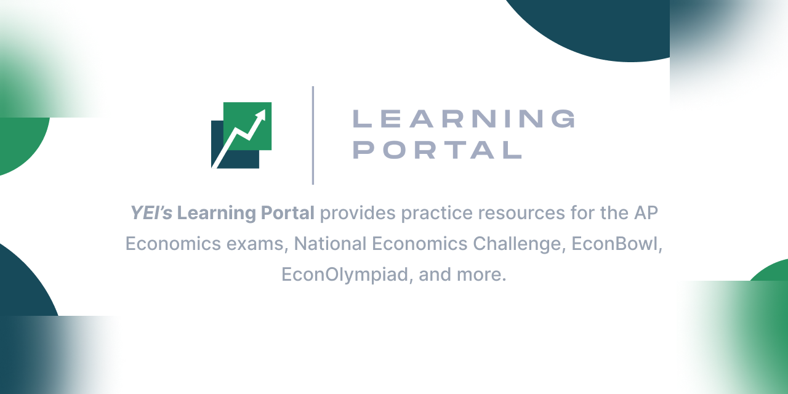

<h1 style="text-align: center">YEI Learning Portal</h1>

Your economics journey starts here.

---

Tech stack:

- Language: TypeScript
- Frontend library/framework: React, NextJS
- Styling: Tailwind
- Auth/DB: Firebase
- Content: MDX

---

## What is The YEI?

[The YEI (Youth Economics Initiative)](https://www.theyei.org/) is the world's largest coalition of high school economics clubs. It has awesome events and programs like [EconBowl](https://www.theyei.org/events/econbowl), [EconClubs](https://www.theyei.org/clubs), and [FLIP](https://www.theyei.org/flip).

---

### Credits

Special thanks to the contributors:

- Brayden W ([@BraydenTW](https://github.com/braydentw))
- Albert Ye ([@xyzyzl](https://github.com/xyzyzl))
- Frank Xiao ([@frankyaoxiao](https://github.com/frankyaoxiao))
- Mason Wang ([@MasonWang025](https://github.com/MasonWang025))
